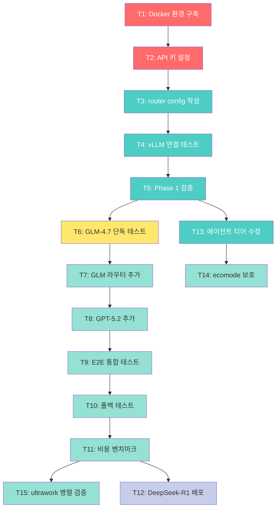

# Maestro Claude Code - 개발 태스크 목록

## 프로젝트 개요

4개 LLM 모델(Opus 4.5, GLM-4.7, GPT-5.2 Codex, Qwen3-Coder-30B)을 오케스트라 메타포로 자동 라우팅하는 하이브리드 에이전트 시스템.

- **기반 기술**: claude-code-router v2.0.0 + oh-my-claudecode v3.10.3
- **목표**: 월 $78 예산으로 4모델 통합, aggregate 750 tok/s 처리량
- **개발 기간**: 4.5일 (Phase 0~4)

---

## Phase 0: 환경 구축 (반나절)

### T1: Docker 개발 환경 구축

- **ID**: T1
- **설명**: Docker 컨테이너 기반 재현 가능한 개발 환경 구축
- **의존성**: 없음
- **우선순위**: P0 (최고)
- **Phase**: 0
- **산출물**: `Dockerfile`, `docker-compose.yml`
- **검증 기준**:
  - [ ] Dockerfile 작성 완료 (Ubuntu 22.04 + Node.js 20 + Python 3.12)
  - [ ] docker-compose.yml 작성 완료 (host 네트워크 모드)
  - [ ] Claude Code CLI 설치 확인 (`claude --version`)
  - [ ] claude-code-router v2.0.0 설치 확인 (`ccr --version`)
  - [ ] MCP 서버 5개 설치 (filesystem, git, memory, playwright, context7)
  - [ ] oh-my-claudecode 설치 확인
  - [ ] VPN 10.5.5.x 서버 접근 가능 확인
  - [ ] `docker-compose up -d` 정상 실행

### T2: API 키 및 보안 설정

- **ID**: T2
- **설명**: 환경 변수 파일 생성 및 보안 설정
- **의존성**: T1
- **우선순위**: P0
- **Phase**: 0
- **산출물**: `.env`, `.env.example`, `.gitignore` 업데이트
- **검증 기준**:
  - [ ] `.env` 파일 생성 (ANTHROPIC_API_KEY, ZAI_API_KEY, OPENAI_API_KEY, TAVILY_API_KEY, VLLM_ENDPOINT)
  - [ ] `.env.example` 템플릿 생성 (실제 키 제외)
  - [ ] `.gitignore`에 `.env`, `.env.*`, `*.key`, `credentials.json` 등록
  - [ ] `chmod 600 .env` 보안 설정
  - [ ] Docker read-only 마운트 설정 (`.env:/root/.env:ro`)
  - [ ] `git status | grep ".env"` — 출력 없음 확인

---

## Phase 1: 기본 라우팅 (반나절)

### T3: claude-code-router config.json 작성

- **ID**: T3
- **설명**: Opus + Qwen3 기본 라우팅 규칙 설정
- **의존성**: T2
- **우선순위**: P0
- **Phase**: 1
- **산출물**: `config/config.json`
- **검증 기준**:
  - [ ] Providers 설정:
    - `anthropic`: Opus 4.5, `https://api.anthropic.com/v1/messages`
    - `cognit`: Qwen3-Coder-30B-A3B, `http://10.5.5.11:8000/v1/chat/completions`
  - [ ] Router 설정:
    - `think` → `anthropic,claude-opus-4-5-20251101`
    - `background` → `cognit,Qwen3-Coder-30B-A3B`
  - [ ] Transformer (cognit):
    - `tooluse` + `enhancetool` + `["maxtoken", {"max_tokens": 15000}]` + `cleancache`
  - [ ] Fallback: `background` → `["anthropic,claude-opus-4-5-20251101"]`
  - [ ] JSON 구문 검증 통과

### T4: vLLM 연결 테스트 (Cognit)

- **ID**: T4
- **설명**: Qwen3-Coder vLLM 서버 연결 확인 및 성능 측정
- **의존성**: T3
- **우선순위**: P0
- **Phase**: 1
- **산출물**: `tests/t4_vllm_connection.sh`
- **검증 기준**:
  - [ ] VPN 10.5.5.11:8000 연결 확인 (`curl /v1/models`)
  - [ ] Qwen3-Coder-30B-A3B 모델 응답 수신
  - [ ] VPN 경유 latency <500ms
  - [ ] `enhancetool` transformer로 tool calling 성공
  - [ ] throughput 150+ tok/s 달성

### T5: Phase 1 검증 테스트

- **ID**: T5
- **설명**: 기본 라우팅(think + background) E2E 검증
- **의존성**: T4
- **우선순위**: P0
- **Phase**: 1
- **산출물**: `tests/t5_phase1_verify.sh`
- **검증 기준**:
  - [ ] think 요청 → 로그에 `anthropic,claude-opus-4-5-20251101` 확인
  - [ ] background 요청 → 로그에 `cognit,Qwen3-Coder-30B-A3B` 확인
  - [ ] Qwen3 응답 속도 150+ tok/s
  - [ ] MCP 도구 정상 동작 (filesystem, git — Opus/Qwen3 각각)
  - [ ] `/model` 수동 전환 동작 확인
  - [ ] 폴백 시뮬레이션: vLLM 중지 → Opus 전환 확인

### T13: 에이전트 티어 수정

- **ID**: T13
- **설명**: 3개 에이전트를 haiku→sonnet으로 승격 (16K 오버플로우 방지)
- **의존성**: T5
- **우선순위**: P1
- **Phase**: 1
- **산출물**: `~/.claude/agents/` 파일 3개 수정
- **검증 기준**:
  - [ ] `explore.md` — `model: sonnet` 설정
  - [ ] `architecture-analyst.md` — `model: sonnet` 설정
  - [ ] `test-specialist.md` — `model: sonnet` 설정
  - [ ] 재시작 후 에이전트 티어 확인
  - [ ] 라우터 로그에서 해당 에이전트 → `zai,glm-4.7` 라우팅 확인

---

## Phase 2: GLM-4.7 단독 테스트 (1일)

### T6: GLM-4.7 단독 모드 테스트

- **ID**: T6
- **설명**: Z.AI GLM-4.7 API 연결 및 단독 코딩 성능 검증
- **의존성**: T5
- **우선순위**: P0
- **Phase**: 2
- **산출물**: `tests/t6_glm_standalone.sh`
- **검증 기준**:
  - [ ] Z.AI API 키 발급 완료 (https://open.z.ai)
  - [ ] GLM-4.7 단독 config.json 작성 및 테스트
  - [ ] CRUD 앱 생성 테스트 — tool calling 3/3 성공
  - [ ] 멀티파일 리팩토링 정확도 확인
  - [ ] 100K 컨텍스트 테스트 (tool call 버그 기록)
  - [ ] MCP 도구 정상 동작 (GLM-4.7 경유)
  - [ ] 응답 품질 확인 (SWE-bench 73.8% 수준)

---

## Phase 3: 4모델 통합 (2-3일)

### T7: GLM-4.7을 default 라우터에 추가

- **ID**: T7
- **설명**: GLM-4.7을 표준(default) 라우팅 규칙에 추가
- **의존성**: T6
- **우선순위**: P0
- **Phase**: 3
- **산출물**: `config/config.json` 업데이트
- **검증 기준**:
  - [ ] Provider 추가: `zai` (`https://api.z.ai/api/anthropic`, GLM-4.7)
  - [ ] Router: `default` → `zai,glm-4.7`
  - [ ] Transformer: `cleancache` (cache_control 제거)
  - [ ] Fallback: `default` → `["anthropic,claude-opus-4-5-20251101"]`
  - [ ] 일반 코드 구현 요청 → GLM-4.7 라우팅 확인
  - [ ] 응답 latency <2s

### T8: GPT-5.2 Codex longContext 추가

- **ID**: T8
- **설명**: GPT-5.2 Codex를 longContext 라우터에 추가 (60K+ 토큰)
- **의존성**: T7
- **우선순위**: P0
- **Phase**: 3
- **산출물**: `config/config.json` 업데이트
- **검증 기준**:
  - [ ] Provider 추가: `openai` (`https://api.openai.com/v1/chat/completions`, gpt-5.2-codex)
  - [ ] Router: `longContext` → `openai,gpt-5.2-codex`
  - [ ] `longContextThreshold`: 60000
  - [ ] Transformer: `cleancache`
  - [ ] Fallback: `longContext` → `["anthropic,claude-opus-4-5-20251101"]`
  - [ ] 60K+ 토큰 프롬프트 → GPT-5.2 자동 전환 확인

### T9: E2E 통합 테스트

- **ID**: T9
- **설명**: 4모델 통합 autopilot 시나리오 E2E 테스트
- **의존성**: T8
- **우선순위**: P0
- **Phase**: 3
- **산출물**: `tests/t9_e2e_test.sh`
- **검증 기준**:
  - [ ] 4모델 라우팅 확인:
    - think → Opus 4.5
    - default → GLM-4.7
    - background → Qwen3-Coder
    - longContext (60K+) → GPT-5.2
  - [ ] 라우팅 정확도 4/4
  - [ ] MCP 도구 공유 확인 (4개 모델 → filesystem, git, memory)
  - [ ] 에이전트 협업 동작 (explore→executor→architect)
  - [ ] `/model` 수동 전환 4개 provider 성공

### T10: 폴백 테스트

- **ID**: T10
- **설명**: 모델 장애 시 자동 폴백 시나리오 검증
- **의존성**: T9
- **우선순위**: P1
- **Phase**: 3
- **산출물**: `tests/t10_fallback_test.sh`
- **검증 기준**:
  - [ ] Cognit vLLM 중지 → background가 GLM-4.7로 폴백
  - [ ] Z.AI API 모의 장애 → default가 Opus로 폴백
  - [ ] OpenAI 장애 → longContext가 Opus 200K로 폴백
  - [ ] 전체 Cloud 장애 → Qwen3-Coder만 (제한 모드 경고)
  - [ ] 로그에서 폴백 경로 추적 확인

### T11: 비용 벤치마크

- **ID**: T11
- **설명**: 실사용 비용 측정 및 월 $78 목표 검증
- **의존성**: T10
- **우선순위**: P1
- **Phase**: 3
- **산출물**: `docs/리포트/cost_benchmark.md`
- **검증 기준**:
  - [ ] 24시간 실사용 비용 측정
  - [ ] 모델별 사용량 트래킹:
    - Opus (think 10%): ~$18/월
    - GLM-4.7 (default 35%): ~$35/월
    - Qwen3 (background 50%): ~$0/월 (로컬)
    - GPT-5.2 (longContext 5%): ~$25/월
  - [ ] 일일 총 비용 ~$2.60 (월 ~$78) 달성
  - [ ] 88% 비용 절감 ($630→$78) 검증

### T14: ecomode 승격 에이전트 보호

- **ID**: T14
- **설명**: ecomode 활성화 시 승격 3개 에이전트(explore, architecture-analyst, test-specialist)가 haiku로 강등되지 않도록 보호
- **의존성**: T13
- **우선순위**: P1
- **Phase**: 3
- **산출물**: ecomode 스킬 수정 또는 보호 로직 문서화
- **검증 기준**:
  - [ ] ecomode 활성화 후 승격 에이전트 티어 확인:
    - `explore`: sonnet 유지 (haiku 아님)
    - `architecture-analyst`: sonnet 유지
    - `test-specialist`: sonnet 유지
  - [ ] 비승격 에이전트는 정상적으로 haiku 우선 시도
  - [ ] ecomode 비활성화 후 원래 티어 복원 확인

### T15: ultrawork 병렬 검증

- **ID**: T15
- **설명**: ultrawork 모드에서 haiku(Qwen3) 병렬 + sonnet(GLM) 순차 동작 확인
- **의존성**: T11
- **우선순위**: P1
- **Phase**: 3
- **산출물**: `tests/t15_ultrawork_verify.sh`
- **검증 기준**:
  - [ ] haiku(Qwen3-Coder) 에이전트 5개 병렬 처리 확인
  - [ ] sonnet(GLM-4.7) 에이전트 순차 처리 확인 (concurrency=1)
  - [ ] sonnet 2개 동시 호출 → concurrency 에러 확인
  - [ ] aggregate throughput ~750 tok/s (150 × 5)
  - [ ] 순차 대비 3배 이상 속도 향상 확인
  - [ ] architect(Opus) 최종 검증 호출 확인

---

## Phase 4: 선택 확장 (반나절)

### T12: DeepSeek-R1-70B Nexus 배포 (선택)

- **ID**: T12
- **설명**: Nexus 서버에 DeepSeek-R1-70B-AWQ vLLM 서빙 및 reasoning 모델 통합
- **의존성**: T11
- **우선순위**: P2 (선택)
- **Phase**: 4
- **산출물**: Nexus vLLM 시작 스크립트, config.json 업데이트
- **검증 기준**:
  - [ ] Nexus(10.5.5.14) vLLM 서빙 성공 (health check 통과)
  - [ ] config.json에 `nexus` provider 추가
  - [ ] `/model nexus,deepseek-r1-70b` 수동 전환 성공
  - [ ] reasoning 작업 품질 확인 (수학, 알고리즘)
  - [ ] `reasoning` transformer 동작 확인
  - [ ] throughput 50+ tok/s (70B dense 모델)

---

## 태스크 의존성 그래프

**범례**: 🔴 Phase 0 | 🔵 Phase 1 | 🟡 Phase 2 | 🟢 Phase 3 | 🟣 Phase 4

---

## 우선순위 정의

| 우선순위 | 의미 | 대상 |
|----------|------|------|
| **P0** | 프로젝트 차단 이슈, 즉시 해결 | T1~T9 |
| **P1** | Phase 완료에 필수, 1일 내 해결 | T10~T15 (T12 제외) |
| **P2** | 선택적 개선 사항 | T12 |

---

## 태스크 요약

| Phase | 태스크 | 소요 시간 | 핵심 목표 |
|-------|--------|-----------|-----------|
| Phase 0 | T1, T2 | 반나절 | Docker + API 키 설정 |
| Phase 1 | T3, T4, T5, T13 | 반나절 | Opus + Qwen3 라우팅 |
| Phase 2 | T6 | 1일 | GLM-4.7 단독 검증 |
| Phase 3 | T7~T11, T14, T15 | 2-3일 | 4모델 통합 + 비용 검증 |
| Phase 4 | T12 | 반나절 | DeepSeek-R1 (선택) |
| **총계** | **15개** | **4.5일** | **88% 비용 절감 하이브리드 시스템** |

---

**작성일**: 2026-02-06
**버전**: 1.0.0
